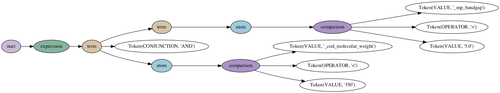

# Contributing

The [Materials Consortia](https://github.com/Materials-Consortia) is very open to contributions to this package.

This may be anything from simple feedback and raising [new issues](https://github.com/Materials-Consortia/optimade-python-tools/issues/new) to creating [new PRs](https://github.com/Materials-Consortia/optimade-python-tools/compare).

We have below recommendations for setting up an environment in which one may develop the package further.

## Getting Started with Filter Parsing and Transforming

Example use:

```python
from optimade.filterparser import Parser

p = Parser(version=(0,9,7))
tree = p.parse("nelements<3")
print(tree)
```

```shell
Tree(start, [Tree(expression, [Tree(term, [Tree(atom, [Tree(comparison, [Token(VALUE, 'nelements'), Token(OPERATOR, '<'), Token(VALUE, '3')])])])])])
```

```python
print(tree.pretty())
```

```shell
start
  expression
    term
      atom
        comparison
          nelements
          <
          3
```

```python
tree = p.parse('_mp_bandgap > 5.0 AND _cod_molecular_weight < 350')
print(tree.pretty())
```

```shell
start
  expression
    term
      term
        atom
          comparison
            _mp_bandgap
            >
            5.0
      AND
      atom
        comparison
          _cod_molecular_weight
          <
          350
```

```python
# Assumes graphviz installed on system (e.g. `conda install -c anaconda graphviz`) and `pip install pydot`
from lark.tree import pydot__tree_to_png

pydot__tree_to_png(tree, "exampletree.png")
```



### Flow for Parsing User-Supplied Filter and Converting to Backend Query

`optimade.filterparser.Parser` will take user input to generate a `lark.Tree` and feed that to a `lark.Transformer`.
E.g., `optimade.filtertransformers.mongo.MongoTransformer` will turn the tree into something useful for your MondoDB backend:

```python
# Example: Converting to MongoDB Query Syntax
from optimade.filtertransformers.mongo import MongoTransformer

transformer = MongoTransformer()

tree = p.parse('_mp_bandgap > 5.0 AND _cod_molecular_weight < 350')
query = transformer.transform(tree)
print(query)
```

```python
{'$and': [{'_mp_bandgap': {'$gt': 5.0}}, {'_cod_molecular_weight': {'$lt': 350.0}}]}
```

There is also a [basic JSON transformer][optimade.filtertransformers.json] you can use as a simple example for developing your own transformer.
You can also use the JSON output it produces as an easy-to-parse input for a "transformer" in your programming language of choice.

```python
class JSONTransformer(Transformer):
    def __init__(self, compact=False):
        self.compact = compact
        super().__init__()

    def __default__(self, data, children):
        items = []
        for c in children:
            if isinstance(c, Token):
                token_repr = {
                    "@module": "lark.lexer",
                    "@class": "Token",
                    "type_": c.type,
                    "value": c.value,
                }
                if self.compact:
                    del token_repr["@module"]
                    del token_repr["@class"]
                items.append(token_repr)
            elif isinstance(c, dict):
                items.append(c)
            else:
                raise ValueError(f"Unknown type {type(c)} for tree child {c}")
        tree_repr = {
            "@module": "lark",
            "@class": "Tree",
            "data": data,
            "children": items,
        }
        if self.compact:
            del tree_repr["@module"]
            del tree_repr["@class"]
        return tree_repr
```

### Developing New Filter Transformers

If you would like to add a new transformer, please add:

1. A module (.py file) in the `optimade/filtertransformers` folder.
2. Any additional Python requirements must be optional and provided as a separate "`extra_requires`" entry in `setup.py`.
3. Tests in `optimade/filtertransformers/tests` that are skipped if the required packages fail to import.

For examples, please check out existing filter transformers.
