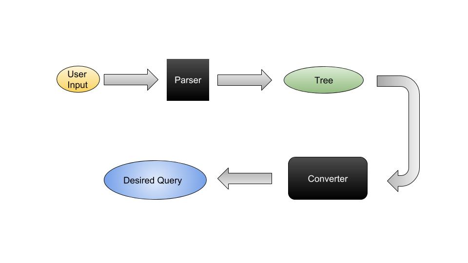

[](https://travis-ci.org/Materials-Consortia/optimade-python-tools)

A library of tools for implementing and consuming
[OPTiMaDe](http://www.optimade.org) APIs in Python.

The aim of OPTiMaDe is to develop a common API, compliant
with the [JSON API 1.0](http://jsonapi.org/format/1.0/)
spec, to enable interoperability
among databases
that contain calculated properties of
existing and hypothetical materials.

### Status
This library is under development. Progress is expected during the [CECAM Workshop on Open Databases Integration for Materials Design](https://www.cecam.org/workshop-4-1525.html) during the week of June 11, 2018 to June 15, 2018.

### Developing

1. Clone this repository to your computer and install the requirements
```
git clone git@github.com:Materials-Consortia/optimade-python-tools.git
cd optimade-python-tools

# Ensure a Python>=3.6 (virtual) environment (example below using Anaconda/Miniconda)
conda create -n optimade python=3.6
conda activate optimade

pip install -e .

# Start a development server (auto-reload on file changes at http://localhost:5000
uvicorn optimade.server.main:app --reload --port 5000

# View auto-generated docs
open http://localhost:5000/docs
# View Open API Schema
open http://localhost:5000/openapi.json
```

### ===For now, be cautious about the below sections. They may not be up to date===

### Getting Started

Install via `pip install optimade`. Example use:

```python
from optimade.filter import Parser

p = Parser(version=(0, 9, 5))
p.parse("filter=a<3")
```
```
Tree(start, [Token(KEYWORD, 'filter='), Tree(expression, [Tree(term, [Tree(atom, [Tree(comparison, [Token(VALUE, 'a'), Token(OPERATOR, '<'), Token(VALUE, '3')])])])])])
```
```python
p = Parser()
p.version
```
```
(0, 9, 5)
```
```python
tree = p.parse('filter=_mp_bandgap > 5.0 AND _cod_molecular_weight < 350')
print(p)
```
```
start
  filter=
  expression
    term
      term
        atom
          comparison
            _mp_bandgap
            >
            5.0
      AND
      atom
        comparison
          _cod_molecular_weight
          <
          350
```
```python
# Assumes graphviz installed on system and `pip install pydot`
from lark.tree import pydot__tree_to_png

pydot__tree_to_png(tree, "exampletree.png")
```


### Flow for Parsing User-Supplied Filter and Converting to Backend Query
`Parser` will take user input to generate a tree and feed that to a `Converter` which will turn that tree into your desired query language.



###### Example: Converting to MongoDB Query Syntax
The `Parser` class from `optimade/filter.py` will transform user input into a `Lark` tree using  [lark-parser](https://github.com/lark-parser/lark).

The `Lark` tree will then be passed into a desired `converter`, for instance, the `mongoconverter` located at `optimade/converter/mongoconverter` for transformation into your desired database query language. We have adapted our mongoconverter by using the [python query language(pql)](https://github.com/alonho/pql)


Usage examples for `mongoconverter` script:
```bash
$ mongoconverter "filter=a<3"
{'a': {'$lt': 3.0}}
$ mongoconverter "filter=_mp_bandgap > 5.0 AND _cod_molecular_weight < 350"
{'$and': [{'_mp_bandgap': {'$gt': 5.0}}, {'_cod_molecular_weight': {'$lt': 350.0}}]}
```

### Developing New Filter Converters
If you would like to add your converter, for instance, a OPTIMade to NoSQL converter, please
1. add your project in the `optimade/converter` folder,
2. add any requirements in the `requirements.txt`,
3. if you wish to have a console entry point, add the that to the `console_scripts` in the `setup.py` file
4. and run `pip install -r requirements.txt` and `pip install -e .`
