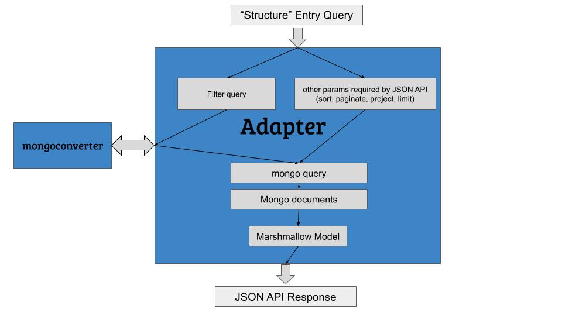

# Summary
This is an [OptiMade](http://www.optimade.org/) implementation for [Materials Project](https://materialsproject.org/).

Currently using [Flask](http://flask.pocoo.org/) for local server.

# Getting started
`cd` into the app directory(the directory that contains app.py, which is probably the directly you are in now)

Execute `python app.py` to start the server

Go to a browser, go to [http://127.0.0.1:5000/](http://127.0.0.1:5000/) or whichever port you have specified. You should see `home` on the upper left corner. This means that Flask is running corretly.

To generate some test urls, `cd ./test/urlGenerator.py`, edit the entries you want to change

Then in your terminal, execute `python urlGenerator.py`, this should output a url for you, for example,
`http://127.0.0.1:5000/optimade/0.9.6/structures?filter=nelements%3C3&response_format=jsonapi&email_address=dwinston%40lbl.gov&response_limit=10&response_fields=id%2Cnelements%2Cmaterial_id%2Celements%2Cformula_prototype&sort=-nelements`

# App Outline

